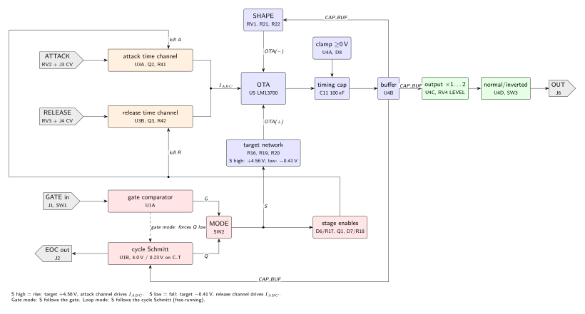
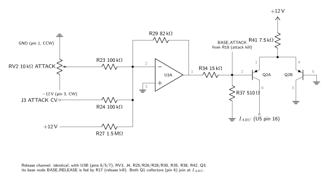
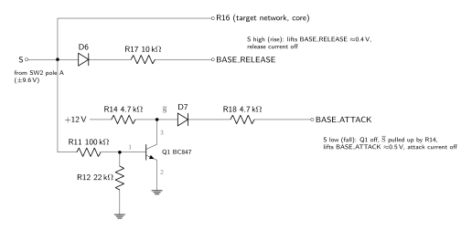
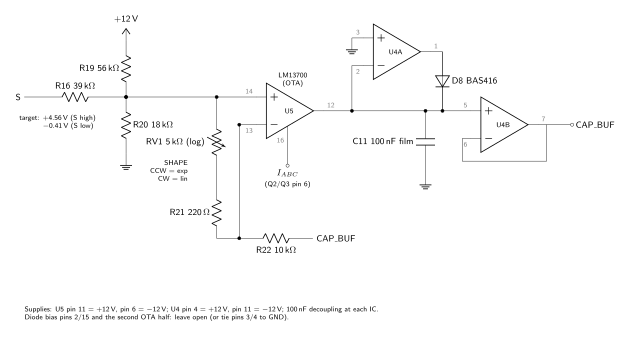
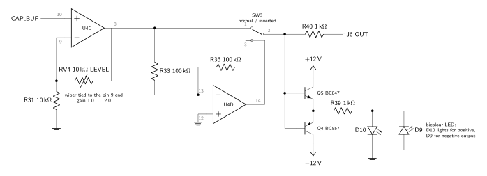
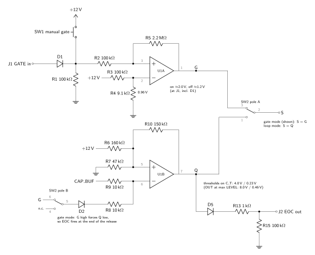
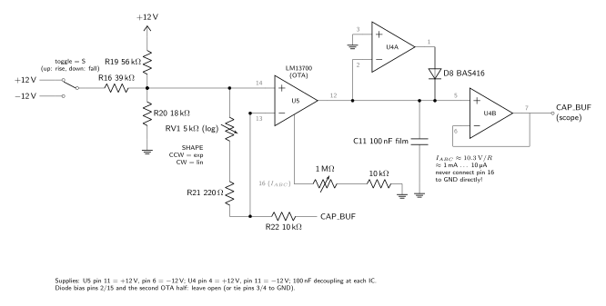

# #02: Loop Envelope

## Hard Requirements
- attack, release  controls via potentiometer (sustain and decay are optional required)
- swtich between gate/looping mode
- switch between linear/exponential curve
- slowest attack/release around 5 seconds 
- fastest attack inaudibly fast (I'm not sure how fast that should be)

## Nice-to-have
- CV for attack, release
- sustain, decay
- even slower attack/release
- gate-to-trigger for plucking modes

## What I already have tried
in my KOSMO build, I have several modules that tick all hard requirements except for the linear mode and the looping mode. I know how to implement the looping mode, but the linear mode has given me several headaches. The current state of the #02 module is a experiment, but linear stage is very finnicky and doesn't work correctly on the breadboard. In an earlier chat, we have determined that the architecture is suboptimal for this purpose. 

## Chips that I have available
I have two Electric Druid ENVGEN8 chips, in DIP format. The datasheet is in the module directory. 
I'm hesitating to use them, as they are THT only, and cost ~5€ per chip. 

I have several LM13700 chips, both in THT and SMD variants. I don't fully understand how it can be used, but it should be suitable for the needs that I have.

## Other design requirements 
I want to keep this part analog, and not rely on a MCU to perform fancy things. 

## Design (rev 2): LM13700 slew core

Status: designed and simulated (behavioural OTA model), **not yet breadboarded**.
Replaces the rev 1 experiment (RC timing with switched transistor current sources for linear mode).

### Principle
An LM13700 outputs a current `I_out = I_ABC * tanh(V_diff / 52mV)` that charges the timing cap C_T.
The OTA input sees the difference between a *target* voltage and the cap voltage:

- large input difference → OTA saturates → constant current → **linear** ramp
- small input difference (heavily attenuated) → current proportional to the error → **exponential** (RC-like) curve

So the curve shape is set by a single resistor between the two OTA inputs (the shape pot), and lin ↔ exp morphs continuously.
The cap is always charged by the same current source; nothing is switched in or out.
Times are set by I_ABC via an exponential converter, so linear pots give a log feel and CV is just a summing resistor.

The cap runs at 0..~4.5V (LM13700 output cannot swing to 10V on real ±12V rails); the output stage scales it by 1..2 (LEVEL).

### Circuit
Schematics drawn from `02_loop_env.net` with circuitikz (sources in [`drawings/tikz/`](drawings/tikz/),
render with `tools/render_tikz.sh 02_loop_env/drawings/tikz`). The KiCad schematic is the reference for values;
the notes below explain the non-obvious choices.

ICs: U1, U3 TL072, U4 TL074 (all 8 sections used), U5 LM13700 (one half used, second half spare, e.g. for a VCA later).
Rails: ±12V nominal.

#### Time channels

- Inverting summer (pot + CV + offset) drives one side of a matched PNP pair with a fixed tail current
  (the exponential converter used in Befaco's Rampage): I_ABC = I_tail / (1 + exp(V_BASE / V_T)).
  Exponential over the useful range, and it can never exceed I_tail (~1.45mA; LM13700 max is 2mA), whatever the CV does.
- Q2/Q3 must be **BCM857BS** (matched dual PNP, SOT-363), not the unmatched BC857BS.
  Matching comes from the shared die, so no reference transistor or op-amp is needed.

#### Stage enables

- Lifting a BASE node by ≳0.4V switches that channel's current off; every extra 0.1V cuts its leakage ~50×.
- R18 is smaller than R17 because S̄ is pulled up through R14 (weak source), while S comes straight from an op-amp.

#### Core

- C11 must be **film or C0G**, not X7R (voltage coefficient bends the linear ramp).
- D8 must be **low-leakage** (BAS416): at the slowest setting C11 is charged with only ~27nA.
- U4A + D8 form an ideal diode that holds C11 at ≥0V, so the release can aim below zero (crisp end, robust to OTA offset)
  while the output still rests at exactly 0V.
- Leave the LM13700 diode-bias pins (2, 15) open; the design uses the bare differential input.

#### Output

- RV4's wiper is tied to the pin-9 end, so a lifted wiper fails safe at maximum gain (2.0) instead of opening the feedback loop.
- Gain 1.0..2.0: gate-mode hold 4.6..9.1V; inverted output 0..−9.1V.

#### Logic

- R5 gives U1A hysteresis so slow or noisy gate edges cannot retrigger.
- D2 makes the gate forcing one-way: without it, a low gate would drag U1B(−) below the lower threshold and fire EOC at the start of the release.
- Pluck (gate-to-trigger) would be a modification of the gate input, not of the core.

### Simulated performance
Simulation files are in [`sim/`](sim/) (`python3 sim/verify.py`, needs ngspice + numpy + matplotlib).
The LM13700 is a behavioural model (tanh law + input bias + offset); TL074 swing is idealised.

| | linear (shape CW) | exponential (shape CCW) |
|---|---|---|
| fastest attack / release (pot CCW) | 0.4 ms | ~1 ms |
| pot at 50% | 32 ms | 81 ms |
| slowest (pot CW) | 14.6 s | ~37 s |

- CV: +1V ≈ 2.8× faster; ±5V spans 0.5ms .. 5.8s at pot 50%
- CV overdrive (+12V CV, pot CCW, rails 11-12V): I_ABC stays ≤1.55mA
- Gate mode: rests at exactly 0V, holds at ≈9.1V while gate is high (LEVEL at max; all output voltages in this section are at max LEVEL)
- Loop mode: ≈0.2-0.5V .. 8V; never stalled over 48 corners of OTA offset (±4mV, datasheet max), rails (11.0-12.0V) and op-amp swing

### Known trade-offs
- At the same knob position, exponential mode is ~2.6× slower than linear.
- Fully exponential curves start with a slight shoulder (the OTA's tanh) before the exponential tail.
- Gate-mode hold (~9.1V at max LEVEL) is deliberately above the loop peak (8V): the gap absorbs worst-case OTA offset so loop mode cannot stall.
- Loop mode does not reach exactly 0V at the bottom.
- BCM857BS is SOT-363 (0.65mm pitch): needs a breakout adapter on the breadboard. Two loose BC857/BC557 work for a breadboard test, but their I_S mismatch shifts the whole time range and they drift with temperature.

### Breadboard plan
1. **Core with a fixed I_ABC:** a toggle stands in for S, a resistor from GND sets I_ABC (attack = release speed, slew-limiter behaviour).
   Check linear vs exponential ramps with the shape pot, the 0V rest level (clamp) and the slope (I = C·dV/dt, 100µA ≈ 1V/ms).

   
2. **One time channel** instead of the resistor (no kill paths needed): pot range ~0.4ms..15s, CV, DC checks
   (common emitters ≈ +0.6V, BASE ≈ −0.02..+0.29V over the pot).
3. **Second channel, enables and gate/Schmitt logic:** the full envelope.

Things to check on the way:
- Slowest times (leakage of clamp diode, OTA output, cap)
- Loop mode at both ends of the shape pot
