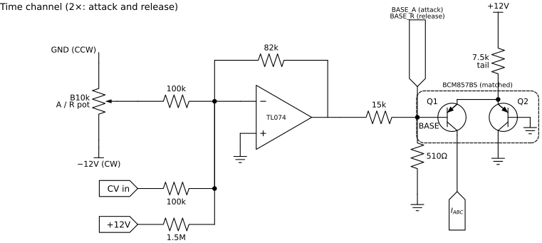
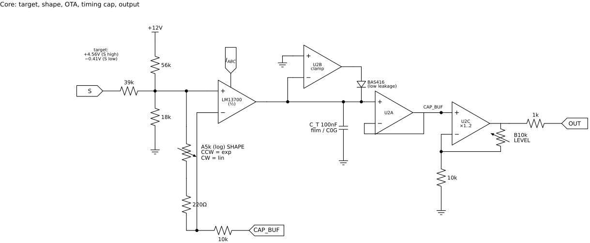
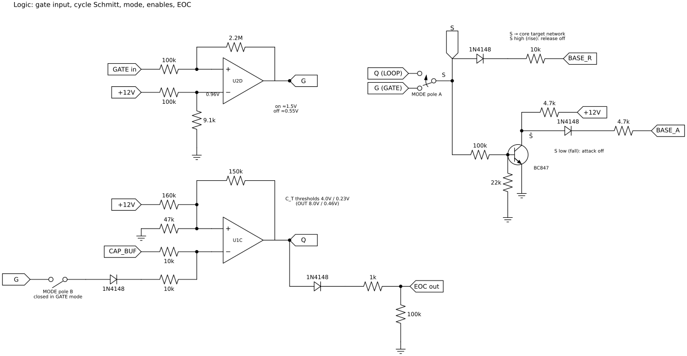
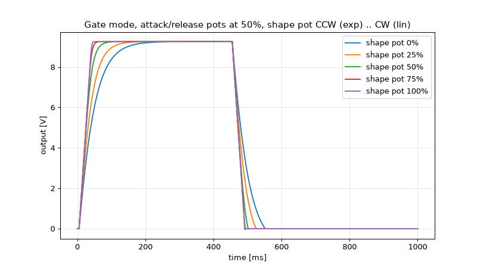
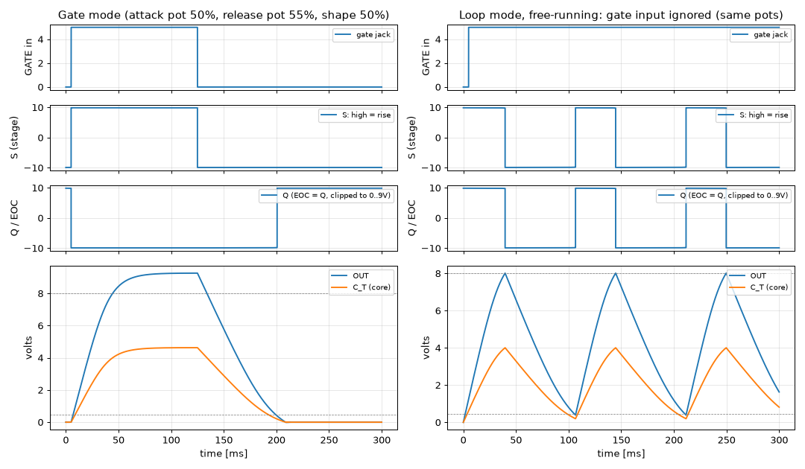

# #02: Loop Envelope

## Hard Requirements
- attack, release  controls via potentiometer (sustain and decay are optional required)
- swtich between gate/looping mode
- switch between linear/exponential curve
- slowest attack/release around 5 seconds 
- fastest attack inaudibly fast (I'm not sure how fast that should be)

## Nice-to-have
- CV for attack, release
- sustain, decay
- even slower attack/release
- gate-to-trigger for plucking modes

## What I already have tried
in my KOSMO build, I have several modules that tick all hard requirements except for the linear mode and the looping mode. I know how to implement the looping mode, but the linear mode has given me several headaches. The current state of the #02 module is a experiment, but linear stage is very finnicky and doesn't work correctly on the breadboard. In an earlier chat, we have determined that the architecture is suboptimal for this purpose. 

## Chips that I have available
I have two Electric Druid ENVGEN8 chips, in DIP format. The datasheet is in the module directory. 
I'm hesitating to use them, as they are THT only, and cost ~5€ per chip. 

I have several LM13700 chips, both in THT and SMD variants. I don't fully understand how it can be used, but it should be suitable for the needs that I have.


## Other design requirements 
I want to keep this part analog, and not rely on a MCU to perform fancy things. 

## Design (rev 2): LM13700 slew core

Status: designed and simulated (behavioural OTA model), **not yet breadboarded**.
Replaces the rev 1 experiment (RC timing with switched transistor current sources for linear mode).

### Principle
An LM13700 outputs a current `I_out = I_ABC * tanh(V_diff / 52mV)` that charges the timing cap C_T.
The OTA input sees the difference between a *target* voltage and the cap voltage:

- large input difference → OTA saturates → constant current → **linear** ramp
- small input difference (heavily attenuated) → current proportional to the error → **exponential** (RC-like) curve

So the curve shape is set by a single resistor between the two OTA inputs (the shape pot), and lin ↔ exp morphs continuously.
The cap is always charged by the same current source; nothing is switched in or out.
Times are set by I_ABC via an exponential converter, so linear pots give a log feel and CV is just a summing resistor.

```
 Attack pot+CV ─► summer ─► PNP pair ─┐                  ┌──► ×1..2 (LEVEL) ─► OUT
                                      ├─► I_ABC ┐        │
Release pot+CV ─► summer ─► PNP pair ─┘         ▼        │
                                      ┌─────────┐  C_T   │
 S ─► target net ─► OTA(+) ─[shape]─ OTA(−)◄──┤ LM13700 ├──┬──► buffer ─┤
       (+4.56/−0.41V)          10k ◄──────────┤  (1/2)  │  │            │
                                              └─────────┘  └─ clamp ≥0V │
 GATE ─► comparator ─► G ─┐                                             │
                          ├─ mode sw ─► S (high = rise, low = fall)     │
 cycle Schmitt (8.0 / 0.45V out) ◄──────────────────────────────────────┘
        └─► Q ─► EOC
```

The cap runs at 0..~4.5V (LM13700 output cannot swing to 10V on real ±12V rails); the output stage doubles it.

### Circuit
Block schematics (generated by [`drawings/draw.py`](drawings/draw.py) with schemdraw; blocks connect via the net tags):





Op-amps: 2× TL074 (7 of 8 sections used, one spare, e.g. for pluck). OTA: 1× LM13700 (one half used, second half spare, e.g. for a VCA later).
Transistors: 2× BCM857BS (matched dual PNP, SOT-363; *not* the unmatched BC857BS), 1× BC847 (inverter). All resistors are E24. Rails as labelled: ±12V nominal.

**Time channels (2×: attack U1A, release U1B)**

Each channel is an inverting summer driving one side of a matched PNP pair with a fixed tail current
(the exponential converter used in Befaco's Rampage). I_ABC = I_tail / (1 + exp(V_BASE / V_T)):
exponential over the useful range, and it can never exceed I_tail (~1.45mA, LM13700 max is 2mA), whatever the CV does.
Matching comes from the shared die, so no reference transistor or op-amp is needed.

| Part | Value | Connection |
|---|---|---|
| Pot | B10k | CCW → GND, CW → −12V, wiper → 100k → summer(−) |
| CV in | 100k | jack → summer(−) |
| Offset | 1.5M | +12V → summer(−) |
| R_f | 82k | summer out → summer(−) |
| Base divider | 15k / 510Ω | summer out → 15k → `BASE`; `BASE` → 510Ω → GND |
| Tail | 7.5k | +12V → common emitters of the pair |
| BCM857BS, Q1 | | B → `BASE`, C → LM13700 I_ABC (both channels' Q1 collectors joined) |
| BCM857BS, Q2 | | B → GND, C → GND |

**Stage enables** (S = stage signal: high = rising, low = falling)

| Part | Value | Connection |
|---|---|---|
| Release kill | 1N4148 + 10k | S → diode → 10k → `BASE_R` |
| Inverter | BC847 | S → 100k → base, 22k base → GND, 4.7k collector → +12V; collector = `S̄` |
| Attack kill | 1N4148 + 4.7k | `S̄` → diode → 4.7k → `BASE_A` |

**Core**

| Part | Value | Connection |
|---|---|---|
| Target net | 39k / 56k / 18k | S → 39k → OTA(+); +12V → 56k → OTA(+); OTA(+) → 18k → GND. Targets +4.56V / −0.41V |
| Shape | 220Ω + **A5k (log)** as rheostat | OTA(+) ↔ OTA(−). CCW = exp, CW = lin |
| | 10k | OTA(−) → `CAP_BUF` |
| C_T | 100nF **film or C0G** | OTA out → GND. Not X7R (voltage coefficient bends the linear ramp) |
| OTA | LM13700 | diode-bias pin and Darlington buffer unused |
| Buffer U2A | TL074 | follower, C_T → `CAP_BUF` |
| Clamp U2B | TL074 + **BAS416** (SOD-323) or BAV199 (SOT-23) | (+) → GND, (−) → C_T, out → diode anode, cathode → C_T. Must be low-leakage: slowest charge current is ~27nA |
| Output U2C | TL074, 10k + B10k LEVEL pot | non-inverting from `CAP_BUF`; 10k (−) → GND, LEVEL pot as rheostat from output to (−) (wiper tied to the (−) end, so a lifted wiper fails safe at max gain). Gain 1.0..2.0: gate-mode hold 4.6..9.1V. 1k → OUT jack |
| Inverted out U2D′ | TL074, 100k/100k | inverting ×1 of the output; Normal/Inverted switch selects which one drives the OUT jack (0..−9.1V when inverted) |

**Logic**

| Part | Value | Connection |
|---|---|---|
| Gate comparator U2D | 100k, 2.2M, 100k/9.1k | jack → 100k → (+), 2.2M out → (+); (−) = 0.96V divider from +12V. On ≈1.5V, off ≈0.55V. Output `G`. Manual gate button also feeds this input |
| Cycle Schmitt U1C | 10k; 150k / 160k / 47k | `CAP_BUF` → 10k → (−); (+) ← 150k from `Q`, 160k from +12V, 47k to GND. Thresholds 4.0V / 0.23V on C_T (8.0V / 0.46V at OUT). Output `Q` |
| Mode switch | DPDT | pole A: S = `G` (gate) or `Q` (loop); pole B (gate mode only): `G` → 1N4148 → 10k → U1C(−), forces Q low while gate is high so EOC fires at end of release |
| EOC out | 1N4148, 1k, 100k | `Q` → diode → 1k → jack, 100k jack → GND; 0 / ~9V |

Pluck (gate-to-trigger) would be a modification of the gate input, not of the core.

### Simulated performance
Simulation files are in [`sim/`](sim/) (`python3 sim/verify.py`, needs ngspice + numpy + matplotlib).
The LM13700 is a behavioural model (tanh law + input bias + offset); TL074 swing is idealised.

| | linear (shape CW) | exponential (shape CCW) |
|---|---|---|
| fastest attack / release (pot CCW) | 0.4 ms | ~1 ms |
| pot at 50% | 32 ms | 81 ms |
| slowest (pot CW) | 14.6 s | ~37 s |

- CV: +1V ≈ 2.8× faster; ±5V spans 0.5ms .. 5.8s at pot 50%
- CV overdrive (+12V CV, pot CCW, rails 11-12V): I_ABC stays ≤1.55mA
- Gate mode: rests at exactly 0V, holds at ≈9.1V while gate is high (LEVEL at max; all output voltages in this section are at max LEVEL)
- Loop mode: ≈0.2-0.5V .. 8V; never stalled over 48 corners of OTA offset (±4mV, datasheet max), rails (11.0-12.0V) and op-amp swing





### Known trade-offs
- At the same knob position, exponential mode is ~2.6× slower than linear.
- Fully exponential curves start with a slight shoulder (the OTA's tanh) before the exponential tail.
- Gate-mode hold (~9.1V at max LEVEL) is deliberately above the loop peak (8V): the gap absorbs worst-case OTA offset so loop mode cannot stall.
- Loop mode does not reach exactly 0V at the bottom.
- BCM857BS is SOT-363 (0.65mm pitch): needs a breakout adapter on the breadboard. Two loose BC857/BC557 work for a breadboard test, but their I_S mismatch shifts the whole time range and they drift with temperature.

### Breadboard checklist
- Slowest times (leakage of clamp diode, OTA output, cap)
- Loop mode at both ends of the shape pot
