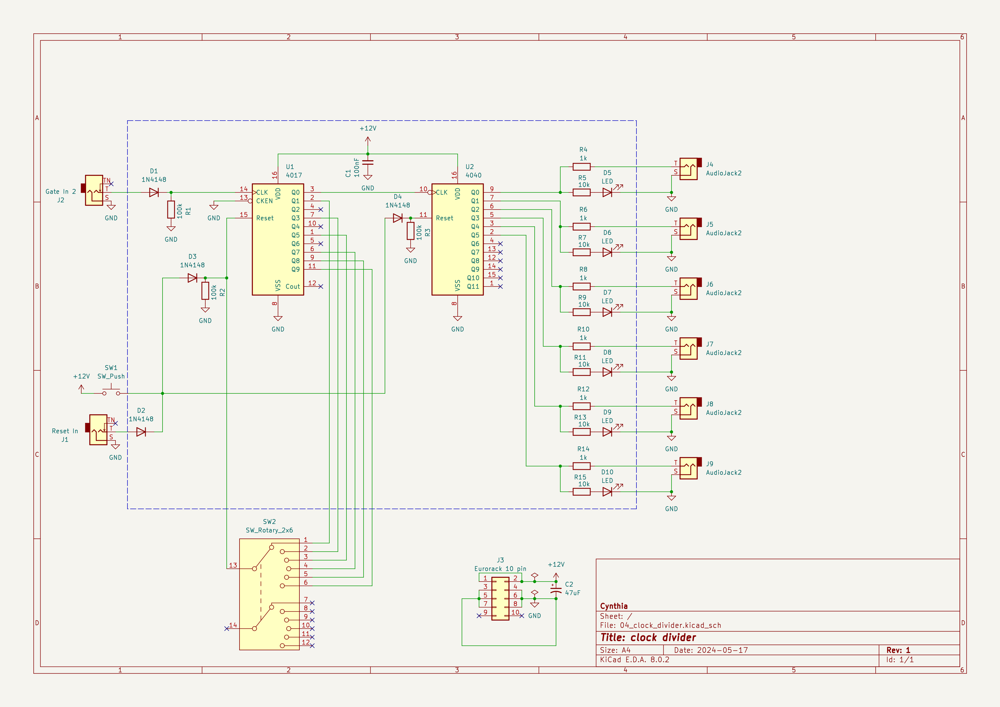
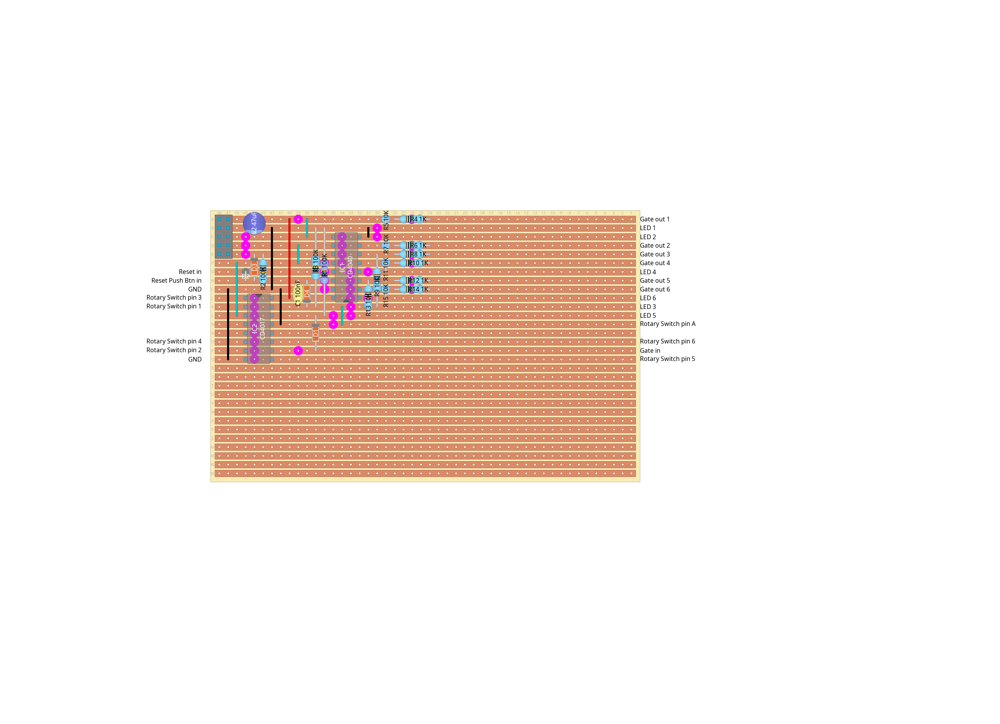
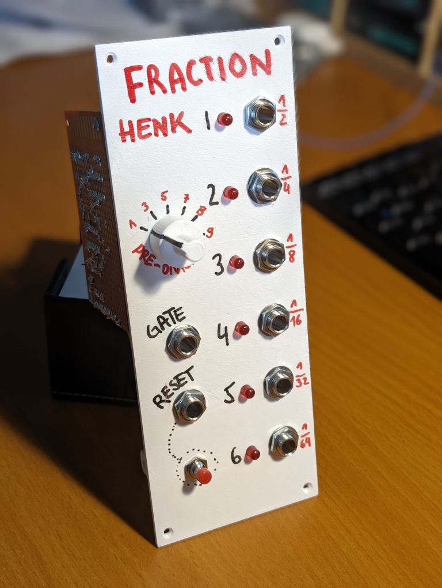
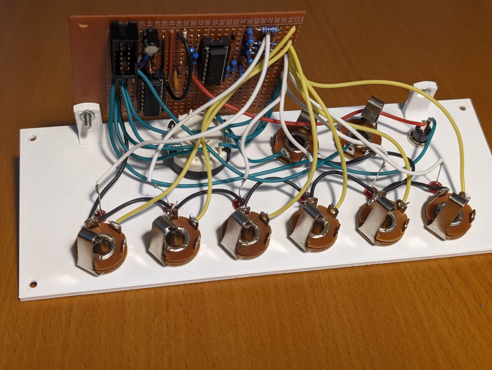

# 04 Clock Divider

This module combines a 4017 and a 4040 to make a binary clock divider.

The 4017 is added to tackle one specific problem: The midi quarter note is divided into 
24 clock signals, and I wanted to be able to get a quarter note pulse from the module.
The rotary switch selects the "pre-division" of the 4017 chip. If it is set to 3, the 4040 will only get every third signal from the gate input.
This way, the 4040 is able to generate pulses for each quarter, half, or whole note etc. 

Setting the rotary swith to other values allows for other funky beats.

## LEDs
I use high-brightness LEDs, which allow me to use chonky 10k resistors and the 4040 is able to power directly.
If you are unsure, check on a breadboard if your LEDS are bright enough with these resistors, and you may need to buffer the LED signals using some NPNs like a BC547 or similar.

## Numbers
The provided design features six division stages of the 4040, resulting in 1/64 of the original signal. 
Combined with the max 4017, the maximum total division = 1/9 * 1/64 = 1/576. 
Applied to a 24 beats / quarter note midi clock signal, this results in one beat every 576/24 = 24 quarter notes.
You should be able to easily extend the module if you want more divisions by tapping into the unused Q6 - Q11 pins of the 4040 chip.

Similarly, I use a six-stage rotary switch simply because I don't have any others laying around. 
If you have one with more stages, I suggest using it and add the other missing pins of the 4017 to the switch.

## Images

### Schematics

### Stripboard 

### Final - front side

### Final - back side

