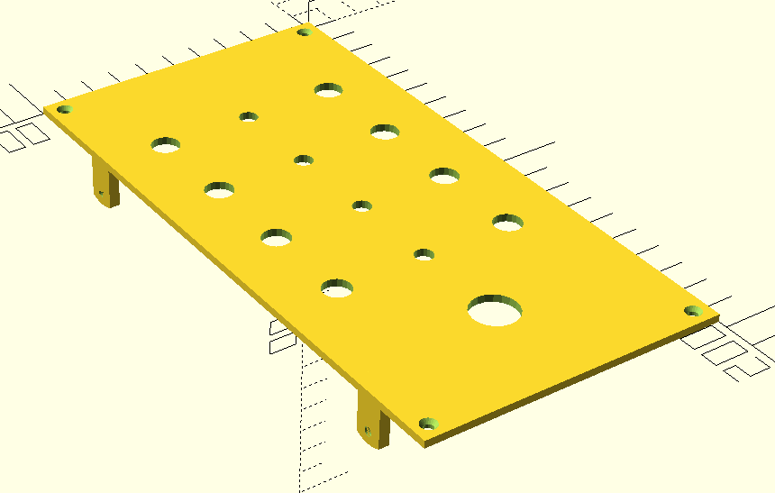
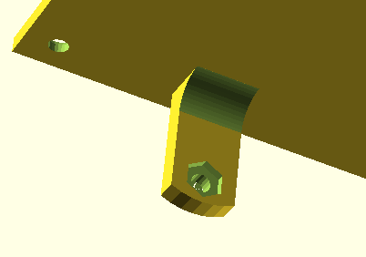

# Cynthia

Plans for my modular synthesizer, named Cynthia.


I have split the modules into folders with numbered names.
These numbers only correspond to the order that I included them into this project.
Every project should at least contain:
- a `README.md` with more information about the module
- `schematics` for the schematics, made in [KiCAD](https://www.kicad.org/)
- `stripboard` for the design of the stripboard (you don't need this if you order proper PCBs). I use [DIY Layout Creator](https://diy-fever.com/software/diylc/) for this.
- `panel` for the Kosmo-format (20cm height) panels. I use a custom template for [OpenSCAD](https://diy-fever.com/software/diylc/) which can be found in `lib/kosmo.scad`.

Some modules have additional subfolders with sound samples or Arduino source code.


## OpenSCAD panels

Design the panels using [OpenSCAD](https://diy-fever.com/software/diylc/), because it is intuitive to me as a programmer.
I then print the panels using a standard filament 3D printer.
The following example generates a panel for the first module, the `01_poly_midi_2_cv`:

```
width = 100;
include <kosmo.scad>

difference(){
    panel(width);
    midiSocket(width/2, panelHeight-35);
    
    buffer=20; // space between border and first item

    jack(buffer, 40); 
    switch(width/2, 40);
    jack(width-buffer, 40);
    
    jack(buffer, 70); 
    switch(width/2, 70);
    jack(width-buffer, 70);
    
    jack(buffer, 100); 
    switch(width/2, 100);
    jack(width-buffer, 100);
    
    jack(buffer, 130); 
    switch(width/2, 130);
    jack(width-buffer, 130);
}
pcbHolders();

```

This results in the following panel: 

I have included two tabs for the PCB that are printed with the panel, to which I can screw the PCB using M3 screws.
The tabs have small indentations for the nuts.



[!NOTE]
The distance between the tabs that I have used depends on the pre-drilled holes of the strip boards that I like to use.
Please change this distance if you have other PCBs.

## Thanks to

I heavily relied on all material by [Moritz Klein](https://www.youtube.com/@MoritzKlein0). Thanks for these awesome videos. These were the starting point for my project.

Further good sources that I recommend are: 
 - https://www.eddybergman.com/
 - https://www.lookmumnocomputer.com/


P.S. I have built Cynthia using striboards, because I wanted to learn and prototype fast.
Should you design some PCBs for any of the modules, I'd love to include them in this repository.
